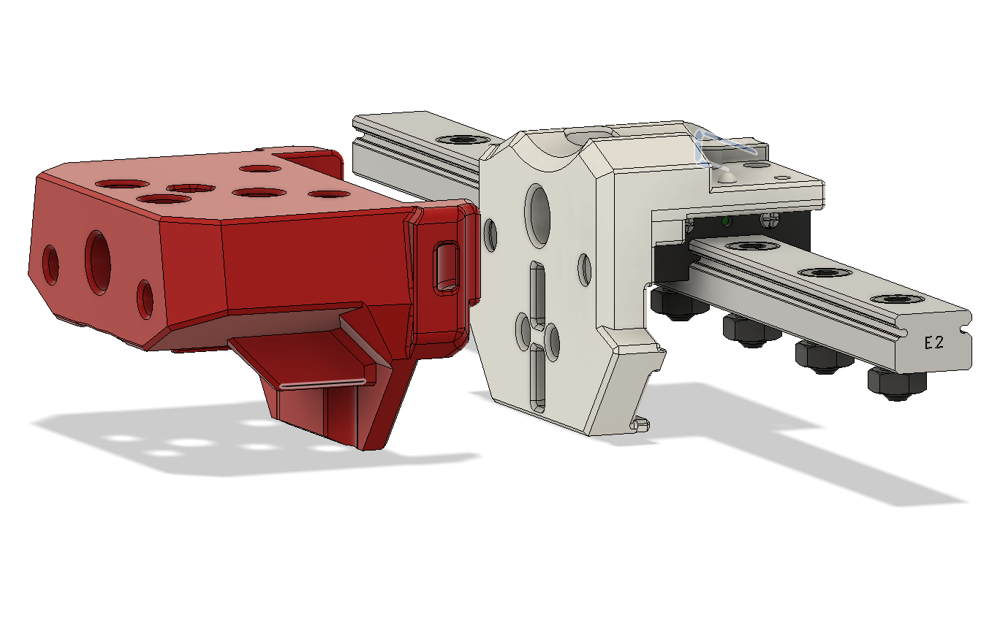
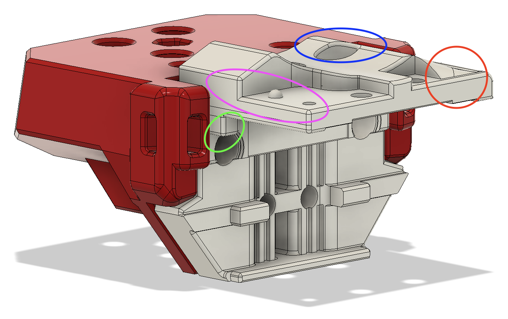

# MGN9C Carraige for SMOL Stealth Burner (V0 Gantry)

This is a carriage mod that allows use of the SMOL Stealth Burner System on a traditional V0 Gantry with top mounted MGN9C. Also includes moded Dragon Adaptor to account for screws on the carriage--this is also needed for his stock MGN7 carraige *(it's a bug/missing)*

Use two m3x40mm SHCS as the screws to assemble all 3 pieces (Shroud, Adapter, Carriage). Do not use anything longer, test screw length before mounting to carriage with all 3, **you do not want screws too long as it'll push against carriage.** Otherwise, two heat set inserts can be inserted into the rear to allow maker beam to be tighter against the belts. Included are both a carriage for MGN9C, and a modified dragon mount that works for both MGN9C and MGN7.

## Update Rev 2

**Blue:** Modified geometry and removed need for printed supports, wasn't effective and changed method.

**Green:** These play double duty and both grip on to the carriage slightly, keep it centered perfectly so no tilt, avoids twists/shifts while screwing in carriage screws... and more! :P

**Pink:** Adjusted down space needed to be narrower, no need for additional material and Omron microswitch still fits perfectly.

**Red:** Changed geometry to add a bit more material to strength that portion and make it a less clear fracture point (similar to green feature)

## Highly recommend printing the updated carriage vs prior revisions. It's only 44 minutes to print and your QOL will improve ! :D

[Find more on Maverick's SMOL Stealth Burner Here](https://github.com/PrintersForAnts/Crucible/tree/main/Smol%20Stealth%20Burner "Find more on Maverick's SMOL Stealth Burner Here")
